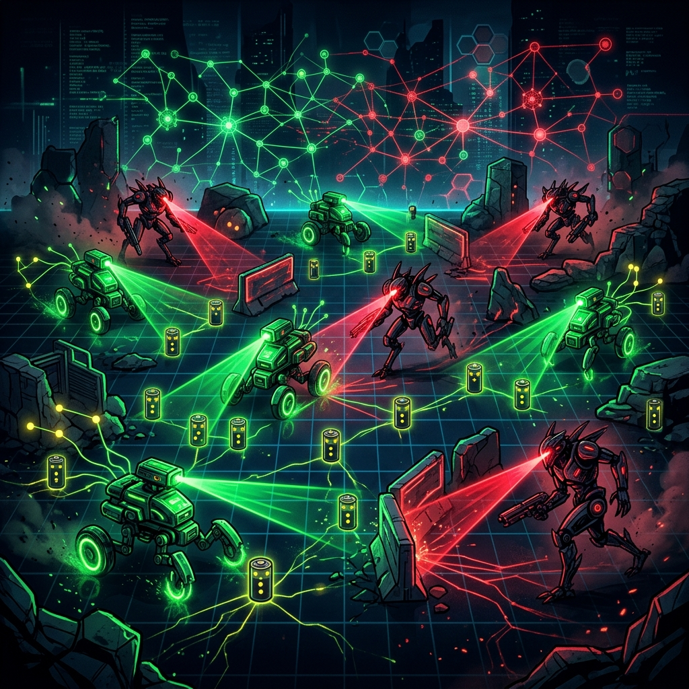

# RoboterEvolution 🤖🧬

Ein Multi-Agenten Neuro-Ökosystem, in dem KI-Roboter (Sammler & Jäger) in Echtzeit Überlebensstrategien erlernen. *"Fressen und Gefressen werden!"*

Dieses Projekt wurde mit KI-Agenten (Antigravity & Google KI) in extrem kurzer Zeit konzipiert und demonstriert eindrucksvoll die Macht von **Neuroevolution of Augmenting Topologies (NEAT)** in einer selbst geschriebenen Pygame-Physik-Umgebung.



🌐 **Mehr Informationen & Video-Showcase:** 
[Mein KI-Portfolio & Entwickler-Blog besuchen](https://tnickel-ki.de/blog-roboterevolution.html)

---

## 🌟 Features

- **Co-Evolution:** Zwei Populationen (Grüne Sammler vs. Rote Jäger) trainieren gleichzeitig in einem evolutionären Wettrüsten gegeneinander.
- **Raycasting-Sensorik:** Roboter "sehen" ihre Umgebung mittels Laser-Strahlen (inkl. Wände, Batterien, Jäger und andere Sammler).
- **Stufe 5 - Schwarmintelligenz:** Roboter können sich gegenseitig wahrnehmen ("Selfish-Herd"-Verhalten) und verfügen über ein Radio-Netzwerk (Antennen) zur aktiven Kommunikation von Gefahren.
- **Turbo-Modus:** Die Grafik-Ausgabe kann abgeschaltet werden, um tausende Generationen in Minuten durch das SpatialGrid und Numba-JIT Raycasting zu jagen.
- **Brain Viewer:** Eine interaktive Live-Ansicht des neuronalen Netzes (inklusive Live-Kommentar-Strategieanalyse) für die Champions der "Hall of Fame".

## 🚀 Technologie-Stack

- **Python 3.12+**
- **Pygame** (Rendering & UI)
- **neat-python** (Neuroevolution)
- **Numba** (JIT-Kompilierung für hochperformante Raycasting-Berechnungen)
- **Matplotlib** (Live-Visualisierung der Fitness-Graphen)

## 🛠️ Installation & Start

1. Repository klonen:
   ```bash
   git clone https://github.com/tnickel/RoboterEvolution.git
   cd RoboterEvolution
   ```

2. Abhängigkeiten installieren:
   ```bash
   pip install -r requirements.txt
   ```

3. Simulation starten:
   ```bash
   python main.py
   # oder einfach über die start.bat
   ```

### 🎮 Bedienung
- Beim Start öffnet sich das Konfigurationsmenü. Hier können alle Physik- und Fitness-Regeln definiert werden.
- **WICHTIG:** Wenn du die Topologie veränderst (z.B. mehr Sensor-Strahlen), lösche zwingend vorher die "Hall of Fame"!
- Drücke **"T"** während der Simulation, um den **Turbo-Modus** für rasant schnelles Training zu aktivieren.
- Klicke im Konfigurationsmenü auf **"Hall of Fame"**, um die Gehirne der besten Roboter aller Zeiten im *Brain Viewer* zu analysieren!

---

💡 *Entwickelt von [Thomas Nickel - AI Software Architect](https://tnickel-ki.de)*
